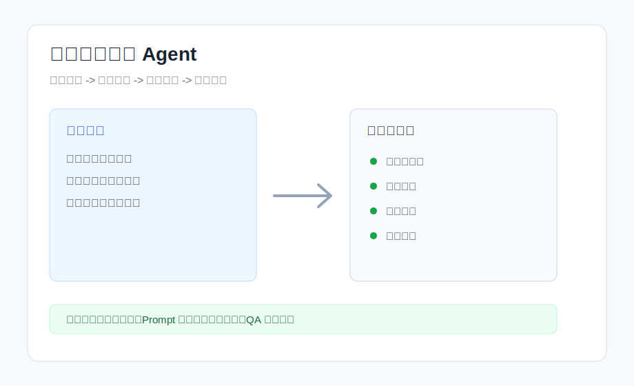
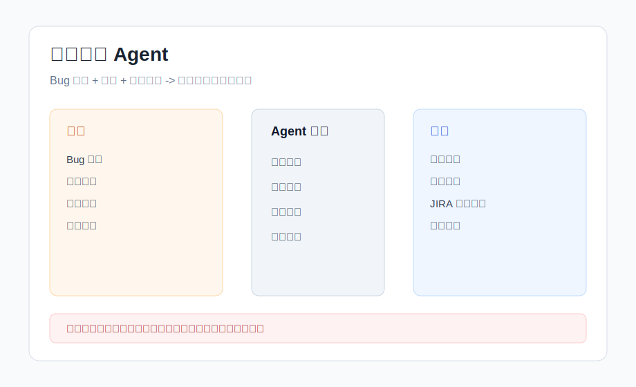
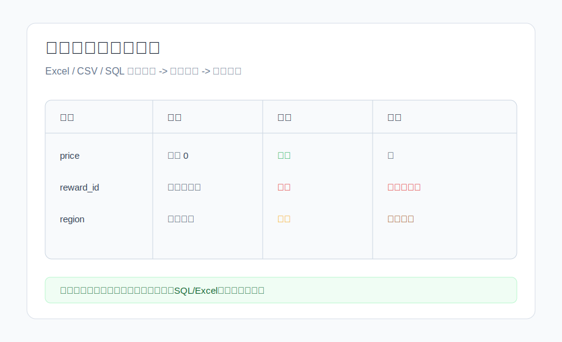
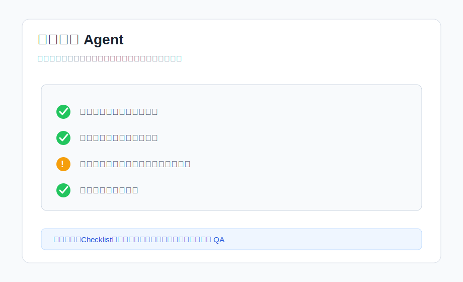

# whitegrown

AI Agent / 自动化测试作品集入口。

我是一名有 11 年游戏 QA、自动化测试、出海发布经验的测试工程师，正在转向 AI Agent 工程师 / LLM 应用工程师方向。这个仓库用于沉淀我在 AI 赋能测试、测试 Agent、缺陷分析、配置校验和发布检查自动化方面的实践。

## 方向定位

- AI Agent 工程：任务拆解、工具调用、执行流程编排、人工确认、结果校验
- 自动化测试：Python 脚本、测试用例生成、回归验证、数据校验、发布检查
- LLM 应用：Prompt 设计、结构化输出、测试数据分析、缺陷归纳、QA 工作流提效
- 游戏研发提效：游戏配置检查、本地化 QA、版本发布清单、复杂功能测试辅助

## 核心能力

| 能力 | 说明 |
| --- | --- |
| 复杂系统测试 | 参与多款游戏从研发到上线的全周期 QA，熟悉功能、性能、兼容、专项测试 |
| 测试流程设计 | 能将复杂需求拆成测试点、边界条件、异常场景和回归清单 |
| 自动化思维 | 使用 Python、DevOps 测试框架、SQL、Redis 等工具提升验证效率 |
| AI 赋能测试 | 使用 ChatGPT 辅助测试用例设计、Excel 数据分析和缺陷识别 |
| 发布风险控制 | 熟悉版本打包、资源部署、海外本地化、公测发布和回归验证 |
| Agent 落地意识 | 关注工具边界、人工确认、日志记录、执行结果校验和失败兜底 |

## 作品集项目

### 1. 测试用例生成 Agent

输入需求文档或功能描述，输出测试点、测试用例、边界场景和风险清单。适合用于复杂功能测试前的用例初稿生成。

- 状态：本地 demo 可运行
- 关键词：需求解析、测试用例生成、结构化输出、测试设计、边界场景
- 截图：[测试用例生成 Agent](assets/screenshots/testcase-agent.svg)
- 说明：[docs/projects/testcase-agent.md](docs/projects/testcase-agent.md)

### 2. 缺陷分析 Agent

输入 Bug 描述、复现步骤、日志片段和模块信息，辅助进行缺陷归类、影响范围判断和修复建议整理。

- 状态：规划 / 原型中
- 关键词：Bug triage、日志分析、缺陷归因、JIRA 工作流
- 截图：[缺陷分析 Agent](assets/screenshots/defect-agent.svg)
- 说明：[docs/projects/defect-agent.md](docs/projects/defect-agent.md)

### 3. 游戏配置表校验工具

面向 Excel / CSV / SQL 配置数据，按规则检查字段缺失、数值范围、关联关系和上线风险。

- 状态：规划 / 原型中
- 关键词：Python、Excel、SQL、规则校验、配置数据
- 截图：[配置校验工具](assets/screenshots/config-checker.svg)

### 4. 发布检查 Agent

根据版本发布清单，辅助检查包体、资源、配置、回归结果、本地化差异和未关闭风险项。

- 状态：规划 / 原型中
- 关键词：发布流程、Checklist、人工确认、风险控制、海外本地化
- 截图：[发布检查 Agent](assets/screenshots/release-agent.svg)

## 快速运行

当前仓库提供一个无需第三方依赖的 Python demo，用于演示“需求文档输入 -> Agent 拆解 -> 测试用例输出”的基本流程。

```bash
python3 examples/testcase_agent_demo.py
```

也可以传入自己的需求文本：

```bash
python3 examples/testcase_agent_demo.py "商城支持购买月卡，支付成功后立即发放奖励，重复购买需要延长有效期"
```

从需求文档读取：

```bash
python3 examples/testcase_agent_demo.py --file examples/sample_requirement.md
```

输出 JSON，方便后续接入 Web 页面、CI 或测试管理平台：

```bash
python3 examples/testcase_agent_demo.py --file examples/sample_requirement.md --format json
```

运行结果会输出：

- 功能测试点
- 测试用例
- 边界场景
- 风险清单
- 回归建议

## 项目截图

| 测试用例生成 Agent | 缺陷分析 Agent |
| --- | --- |
|  |  |

| 配置校验工具 | 发布检查 Agent |
| --- | --- |
|  |  |

更多截图说明见：[docs/screenshots.md](docs/screenshots.md)

## 与 AI Agent 工程师岗位的匹配点

- 能把真实业务流程拆成 Agent 可执行的步骤
- 理解高风险操作必须有确认、日志和结果校验
- 有 QA 背景，天然关注异常场景、边界条件和回归验证
- 有自动化测试和发布流程经验，适合做测试 Agent、研发提效 Agent、办公自动化 Agent
- 熟悉游戏研发和出海发布场景，可切入游戏行业 AI 工具链建设

## 后续计划

- 接入真实 LLM API，输出 JSON 格式测试用例
- 增加 Excel / CSV 配置表校验 demo
- 增加 JIRA 缺陷字段生成模板
- 增加本地化文本检查规则
- 增加 README 中的真实运行截图和 GIF

## 联系方式

- GitHub：whitehigh
- Email：whitegrown@gmail.com
- WeChat：louxibugai
